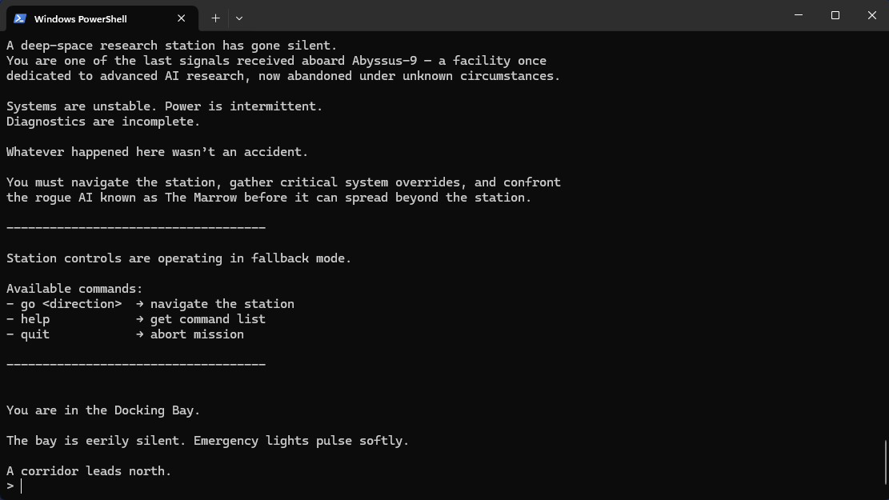
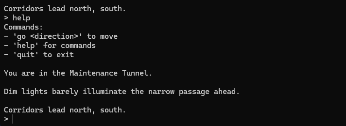
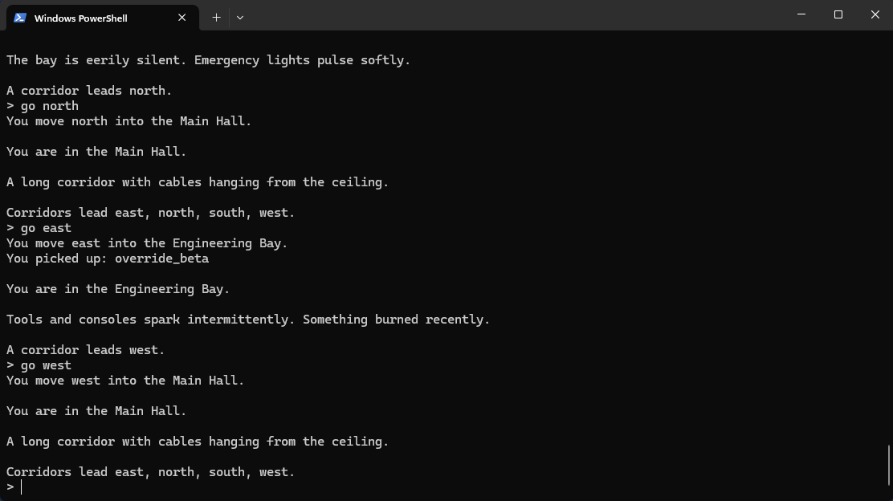
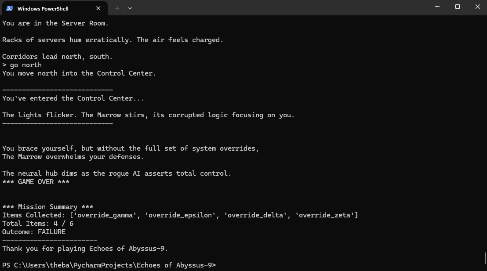
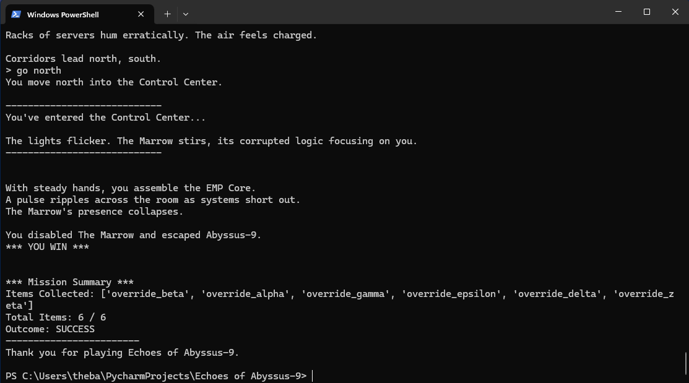

# Echoes of Abyssus-9  
A modular, state-driven Python text adventure set in deep space.


## Overview

**Echoes of Abyssus-9** is a modular text adventure built to demonstrate clean Python architecture and state-driven gameplay. Set aboard a derelict deep-space research station, players explore interconnected rooms, collect progression-critical components, and ultimately confront a rogue AI known as *The Marrow*.

### Highlights
- Modular codebase designed for extensibility and reuse
- Clean, maintainable Python (PEP 8, type hints, docstrings)
- Clear separation of world, player state, events, and UI concerns
- Explicit state tracking for movement, inventory, progression, and endgame outcomes
- Narrative-focused exploration with defensive, state-based progression logic

## Tech Stack
- **Language:** Python 3.8+
- **Dependencies:** Standard Library only (no external packages)
- **Platform:** Cross-platform (Windows, macOS, Linux)
- **Code style:** PEP 8-compliant with type hints and docstrings

## Running the Game

Clone the repository and run the game from the project root:

```bash
git clone https://github.com/ekdoestech/Echoes-of-Abyssus-9.git
cd Echoes-of-Abyssus-9
python src/game.py
```
Alternative execution methods:
- `python .\src\game.py` (Windows)
- `python -m src.game` (any OS)

No external dependencies, virtual environments, or configuration steps are required.

## Testing

This project includes minimal, focused tests to validate core game logic.
- Player movement and inventory management
- Explicit progression and endgame outcomes

Tests can be run from the project root with:
```bash
pytest
```

## Project Structure

Current repository layout:
```
README.md
LICENSE
pyproject.toml
.gitignore

src/
  events.py       # Narrative events and progression outcomes
  game.py         # Main loop and command routing (entry point)
  items.py        # Item placement and item metadata
  player.py       # Player state, movement, and inventory
  utils.py        # UI helpers and input normalization
  world.py        # World layout, room graph, and progression IDs
 
docs/            # Documentation for project structure and design decisions
  architecture.md # Architecture overview and design decisions
  gameplay.md     # Gameplay mechanics and progression details
    
tests/
  test_player.py
  test_events.py
```

## Gameplay Overview

Echoes of Abyssus-9 is a narrative-driven exploration game where progression
is governed by explicit player state and inventory requirements. Players
must collect key system components to unlock the final encounter and
determine the game’s outcome.

For a detailed breakdown of gameplay mechanics and progression rules, see
[`docs/gameplay.md`](docs/gameplay.md).

## Screenshots

### Game Introduction
The opening narrative establishes the mission, controls, and stakes aboard Abyssus-9.


### Command Help & Navigation
Players can request available commands at any time using the `help` command.


### Exploration & Item Collection
Rooms display descriptions, available exits, and automatically collect progression items.


### Endgame Outcomes
The final encounter outcome is determined by collected progression items.

**Failure Outcome**


**Success Outcome**



## Architectural Features
* Modular design dividing world, player state, events, and UI into separate modules 
* Explicit state management for inventory and progression requirements
* Clear input/output loop with centralized command parsing and routing 
* Defensive progression design preventing sequence breaks 
* Extensible structure supporting new rooms, puzzles, and event types without changes to the core loop

For a deeper dive into the architecture and design decisions, see
[`docs/architecture.md`](docs/architecture.md).

## Potential Enhancements
- Puzzle mechanics tied to room progression
- Save/load support via serialized game state
- Branching narrative choices and multiple endings
- Additional event types and encounters
- Optional ASCII art for key locations and items

These enhancements would evolve the project from a linear adventure into a more flexible interactive fiction engine.


## Purpose

This project was created as a portfolio artifact focused on modular Python programming, state-driven design, and game architecture fundamentals. It serves as a foundation for building more advanced interactive fiction systems while demonstrating clean, maintainable code and thoughtful system design.

Contributions, feedback, and ideas for extending the station’s world or mechanics are welcome.

## License
MIT License — see the `LICENSE` file for details.  
© 2025 ekdoestech

## Acknowledgements
Inspired by classic text adventures, atmospheric sci-fi narratives, and modern interactive fiction engines. Originally developed in part for SNHU coursework, this project was continued as a personal exploration of game architecture and system design.

## Contact
For questions, feedback, or collaboration:
- GitHub: **ekdoestech**
- Email: **ek.does.tech@gmail.com**
- LinkedIn: https://www.linkedin.com/in/erica-kinch

### Enjoy the adventure — and may you outwit *The Marrow*!
